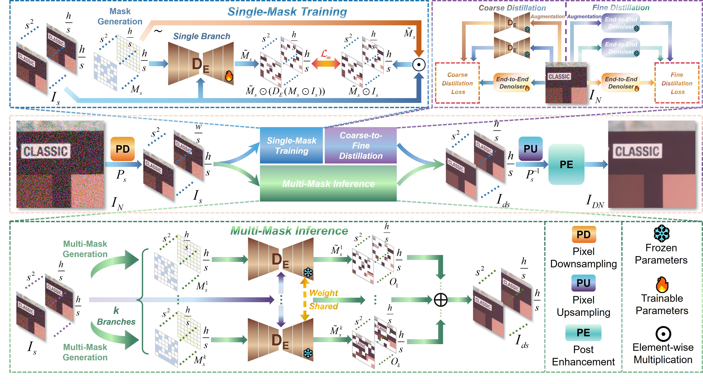
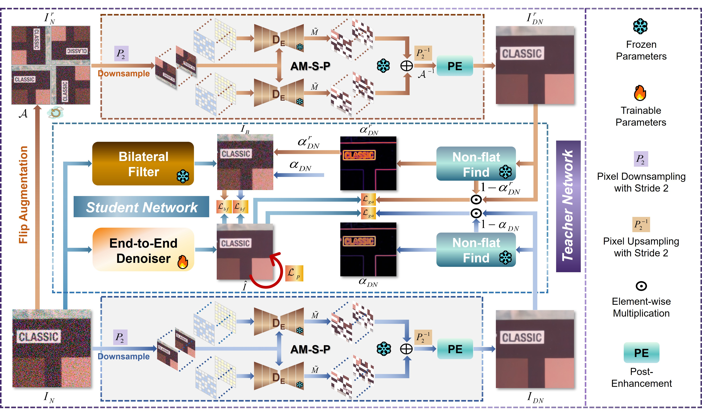
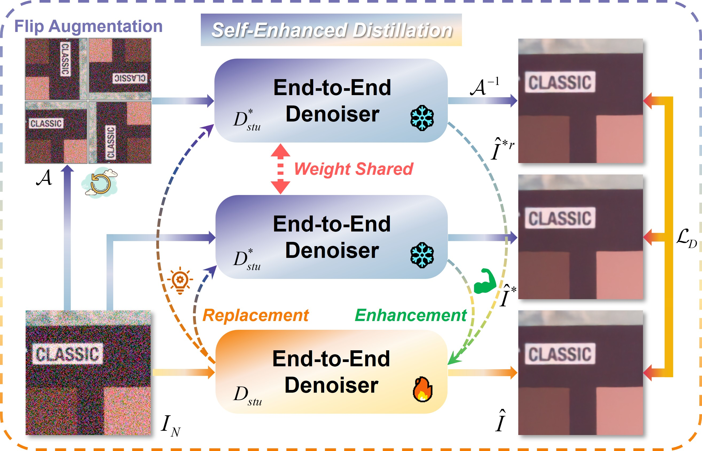
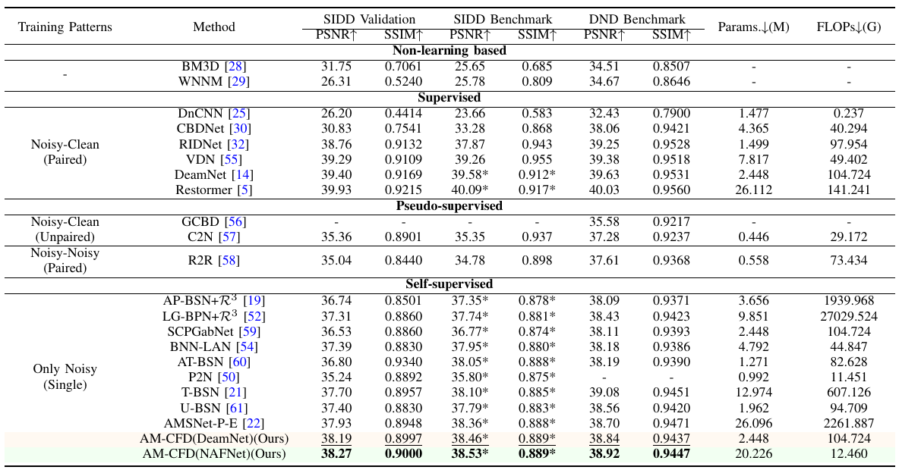
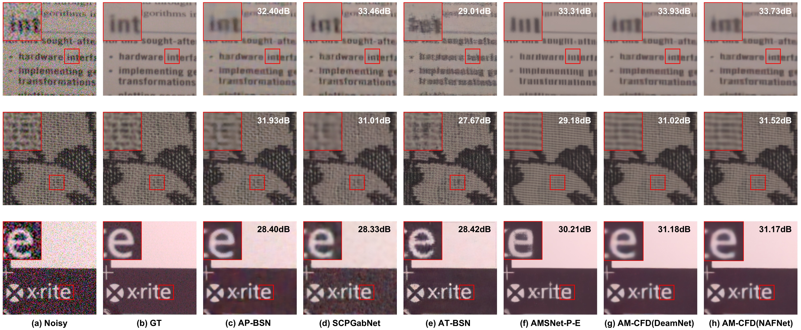
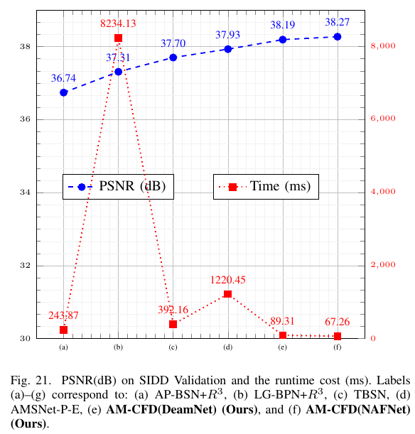

# Efficient Self-Supervised Real-World Image Denoising via Asymmetric Masking and Coarse-to-Fine Distillation

[](https://arxiv.org/abs/xxxx.xxxxx)
[](https://github.com/yourname/AM-CFD)
[](https://opensource.org/licenses/MIT)

**AM-CFD** is a novel self-supervised image denoising framework that achieves state-of-the-art performance while being significantly more efficient than existing methods. This repository contains the official implementation of our paper.

<p align="center">
  
</p>
<p style="text-align: justify; text-justify: inter-word;">
  <em>Comparison between our method and BSN-based approaches (typically augmented with post-enhancement strategy) for real-world image denoising. Post-enhancement refers to refinement operations such as $R^3$. As illustrated in the figure, our AM-CFD achieves superior denoising performance by more effectively restoring fine details, all while maintaining architectural flexibility and high computational efficiency.</em>
</p>

## 🏗️ Method Overview

### 1. Complete Distillation Pipeline

Our framework systematically transfers knowledge from the powerful AM-based teacher to an efficient student network through:

1. **Structure-aware loss design** for region-adaptive learning
2. **Bilateral filtering guidance** for detail preservation  
3. **Self-enhanced fine distillation** for iterative refinement

### 2. Two-Stage Distillation Architecture

<p align="center">
  
  <br>
  <em>Our complete distillation pipeline from coarse knowledge transfer to self-enhanced fine refinement.</em>
</p>


## 🚀 Key Innovations

### 1. Complete Knowledge Distillation Pipeline for AM-Based Denoising
We systematically develop a complete knowledge distillation framework based on the Asymmetric Mask (AM) self-supervised denoising mechanism. Through distinctive innovations including **structure-aware loss functions**, **bilateral filtering guidance**, and **self-enhanced fine distillation**, this pipeline successfully compresses the high-performance but computationally heavy AM-based denoiser into a lightweight single-pass network.

### 2. Coarse-to-Fine Distillation (CFD) Module
We introduce a novel Coarse-to-Fine Distillation (CFD) module that replaces the costly multi-step inference required by traditional methods. CFD enhances detail reconstruction and improves objective metrics through progressive refinement, achieving an optimal balance between **performance** and **efficiency**.

<p align="center">
  
</p>
<p style="text-align: justify; text-justify: inter-word;">
  <em>Architecture of the Coarse Distillation (CD) stage.</em>
</p>

<p align="center">
  
</p>
<p style="text-align: justify; text-justify: inter-word;">
  <em>Architecture of the Fine Distillation (FD) stage.</em>
</p>

### 3. Structure-Sensitive Training Strategy
We propose a structure-sensitive loss that intelligently guides the student network: it learns bilateral-filtered details in **textured regions** while mimicking the teacher's output in **flat areas**. Enhanced by flip augmentation and a self-refined fine-distillation stage, this two-stage coarse-to-fine strategy significantly boosts both **detail fidelity** and **model robustness**.

## 📊 Performance Highlights

### Quantitative Results
*Results on SIDD validation and DND benchmark. Speed measured on RTX 3090 for 256×256 images.*



### Visual Comparisons
<p align="center">
  
  <br>
  <em>Denoising results of different methods on the SIDD validation.</em>
</p>

<p align="center">
  
  <br>
  <em>Denoising results of different methods on DND Benchmark.</em>
</p>

<p align="center">
  
  <br>
  <em>The result of denoising noise images taken with HUAWEI P20.</em>
</p>

<p align="center">
  
  <br>
  <em>The result of denoising noise images taken with OnePlus Ace 2.</em>
</p>


## 🛠️ Features

- **🔄 Complete Distillation Pipeline**: Systematic knowledge transfer from AM-based teacher to efficient student
- **⚡ Coarse-to-Fine Refinement**: Progressive optimization through two distinct distillation stages
- **🎯 Structure-Aware Training**: Intelligent loss design for different image regions
- **🔧 Efficient Inference**: Single-pass network with 18× speedup over baselines
- **📈 Extensive Evaluation**: Comprehensive validation on SIDD, DND, PolyU, and IOCI datasets

## 📈 Efficiency Analysis

<p align="center">
  
  <br>
  <em>AM-CFD achieves the best performance-efficiency trade-off, dominating the Pareto frontier.</em>
</p>


## 🚦 Quick Start

Coming soon! Code will be released upon publication.

## 📝 Citation

```bibtex
@article{amcfd2025,
  title={Efficient Self-Supervised Real-World Image Denoising via Asymmetric Masking and Coarse-to-Fine Distillation},
  author={Authors},
  journal={},
  year={2025}
}